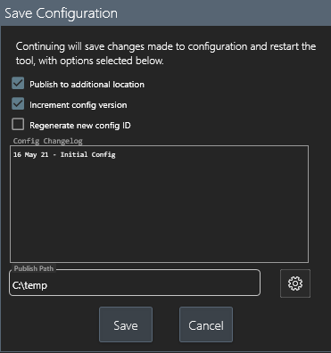

# v2 Configurable Support Toolkit
A fully customizable, multithreaded support toolkit designed to easily add constructed PowerShell fix actions for tier-I/tier-II execution. Written in WPF/PowerShell.

For the end user (a tier-I, tier-II, or other support technician), the tool provides a quick interface to easily search a user or computer from within ADDS, pull reverent information, and execute various actions. All of this - the shown information and its presentation, the executable actions, and even the search term themselves are all definable from within the tool itself using PowerShell script blocks.

<b>Technician view:</b>

All settings are internally configurable. These include ADDS computer and user properties, login log definitions, standalone PowerShell scripts, remote access clients, and more.

<b>Configuration view:</b>

<b>Configuration view (general settings tab):</b>
 

<b>Configuration view (user AD properties):</b>
 

<b>Configuration view (user AD property attached script block):</b>
 

All settings can be centrally published to a configuration file to share internally. Clients pulling from this config will then monitor it for later updates. This can be easily accomplished be 'saving' the configuration from the configuration view - other clients that import from this will continue to monitor the published location for updates.

<b>Configuration view (exporting a configuration file):</b>
 

All actions searches and script executions initiated from within the tool are logged. From within the tools view, default reports easily allow tracking of these for multiple technicians.

<b>Tool view (exporting a report):</b>

These reports, using PSWriteHTML, will display events according to the selected timeframes.

<b>Report view:</b>

